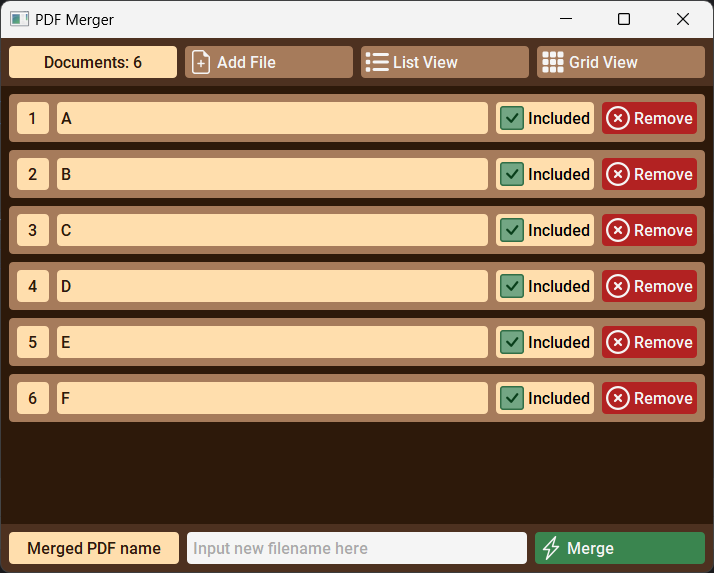
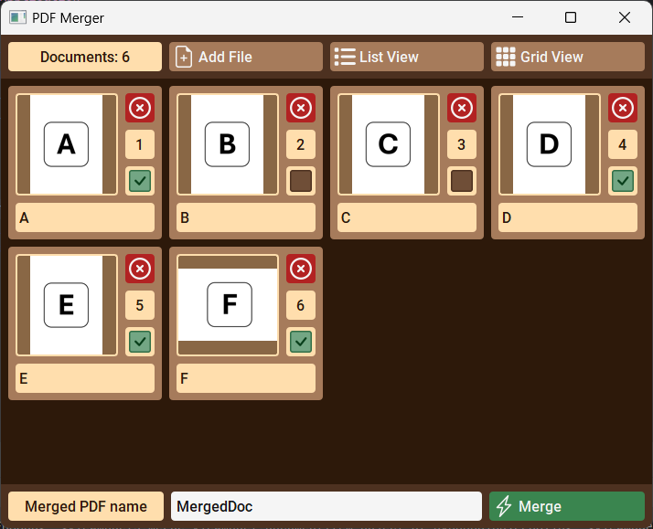

# WORK IN PROGRESS

# PDF Merger

## Description
A PyQt application for merging PDF documents

## Portable Application
TODO

## Screenshots

  
  

## Tools
+ PyQt - GUI framework
+ SCSS - Styling
+ MVVM - Design pattern
+ Publisher/Subscriber - Design pattern

## License
TODO
